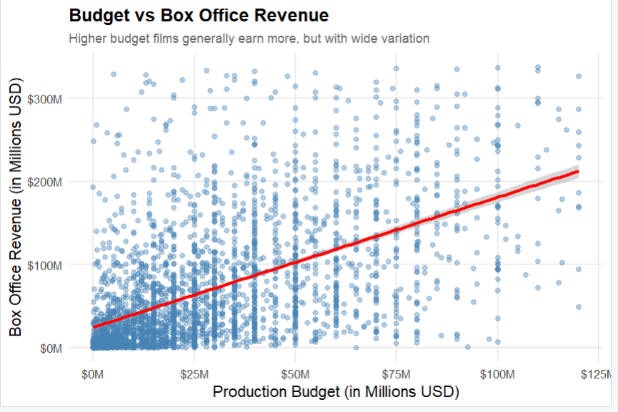
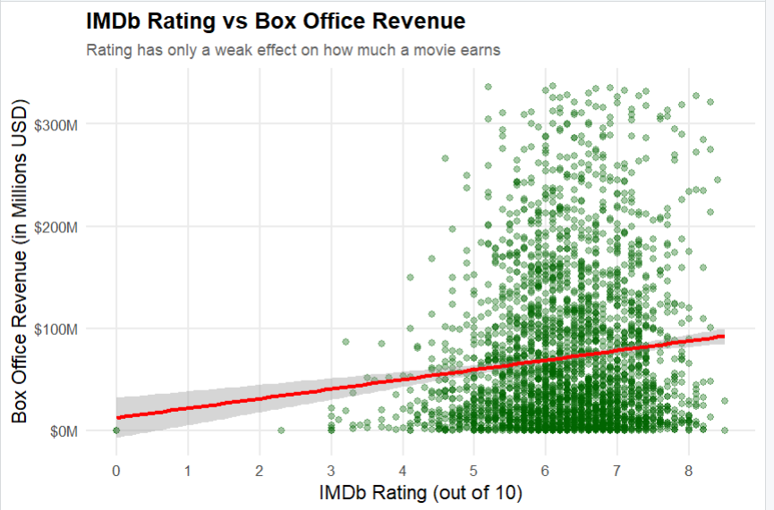
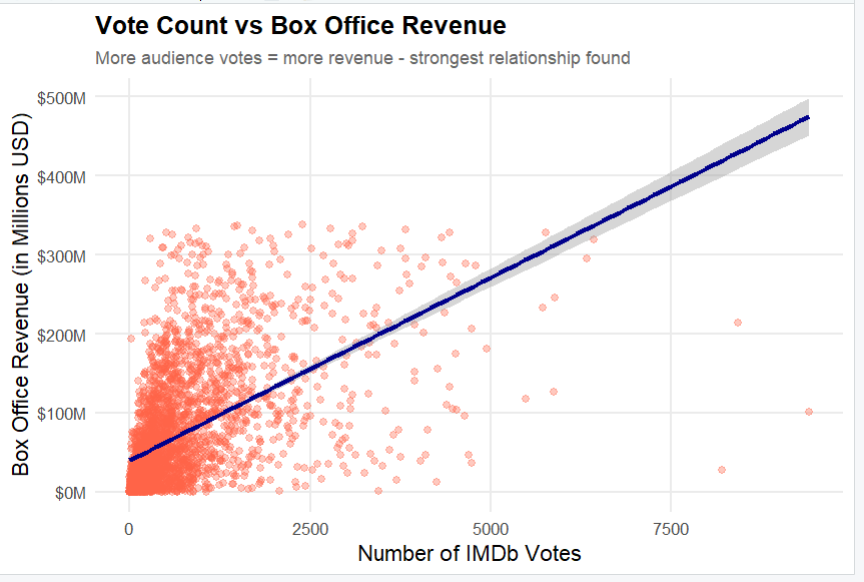
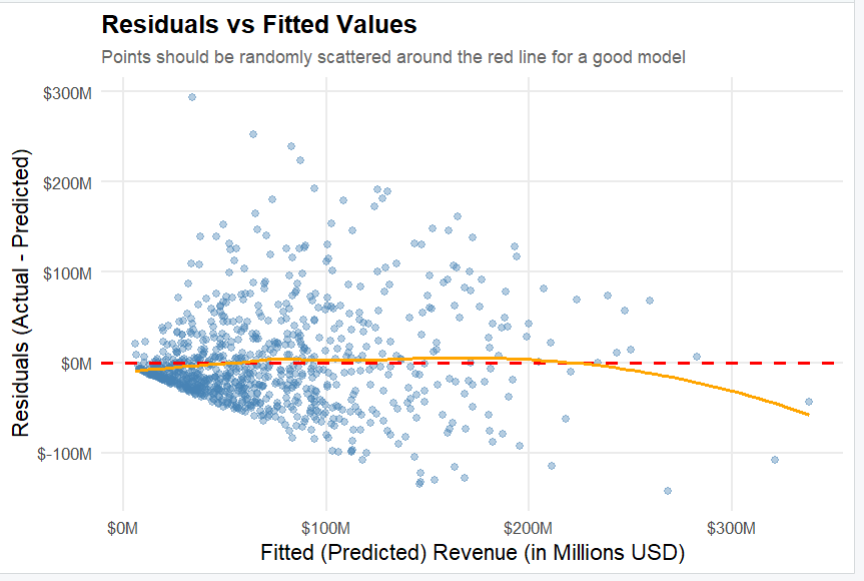

# Movie Success Analysis

Movie revenue prediction and success analysis using R and TMDB 5000 dataset.

## Features
- Data Cleaning
- Exploratory Data Analysis
- Correlation Analysis
- Linear Regression
- Logistic Regression

## Tools Used
- R
- ggplot2
- TMDB 5000 Dataset

## Results
- Linear Regression R² = 0.71
- Logistic Regression Accuracy = 74%

## Visualizations

### Budget vs Revenue

### IMDb Rating vs Revenue

### Vote Count vs Revenue

### Residuals vs Fitted

### Residuals vs Fitted

